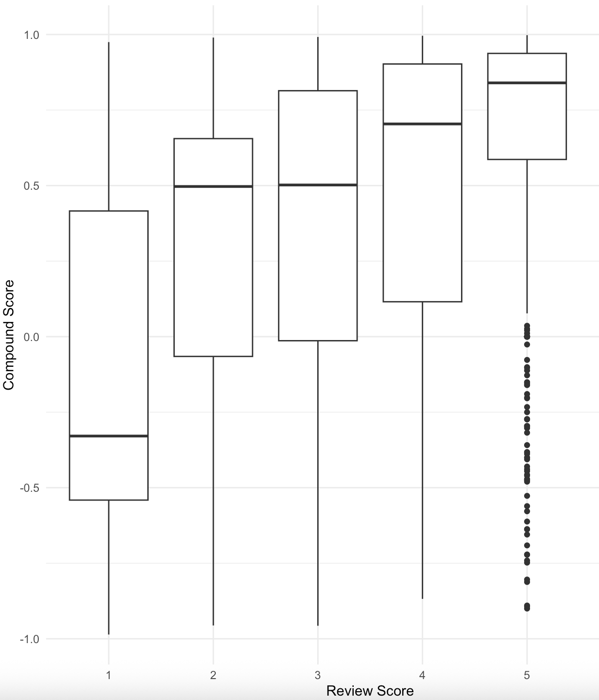

# Metadata

## Data Summary

Our dataset consists of Amazon product reviews, specifically focused on Health-related products. It includes 1,265 rows and 17 columns with information such as product name, product ID, reviewer name, reviewer ID, product rating, text review, and a sentiment score generated using the VADER sentiment analysis tool. Product examples include armrest covers, foot cushions, socks, and medicine, with prices ranging from $1–$99. The dataset has been cleaned and transformed from its original TXT format into a CSV file to allow for structured analysis. The cleaned dataset is available in our GitHub repository: DS-4002-Project1 / datafolder / AmazonWithScores.csv https://github.com/hildj/DS-4002-Project1 

## Provenance

The dataset originates from the Stanford Network Analysis Platform (SNAP), which compiles product review data from Amazon. The full dataset includes over 34 million reviews from more than 6 million users, spanning June 1995 to March 2013. For this project, we narrowed our scope to the Health products subset. We removed uninformative columns, restructured the TXT file into CSV format, and ran VADER sentiment analysis in Python to generate sentiment scores. These scores were merged back into the dataset to support our exploratory analysis.

## License

The original dataset is made publicly available through SNAP. Our cleaned version and analysis outputs will be shared in our GitHub repository under the same open-use conditions, following SNAP’s licensing requirements and citing SNAP usage.

## Ethical Statements

review.UserID (User IDs) will be treated as anonymous identifiers to protect privacy. Since reviews concern health products, we acknowledge that they may not always reflect medical accuracy or reliability. Customer opinions are subjective and sentiment analysis should be interpreted cautiously in this context. We use reviews strictly for analytical and educational purposes, not for making health-related claims

## Data Dictionary

| Column | Description | Potential Response |
| :------- | :------- | :------- |
| product.productId | Id of the product being reviewed | B000FKHNK0, B000BDDFJ4|
| product.title | Title of the product being reviewed | Nature's Way Oregano Oil, Zand Herbal Mist Throat Spray |
| product.price | Price of the product being reviewed | 99.95, 50|
| review.profileName | Profile name of the reviewer | C. C. Bailey, Dark Avenger|
| review.score | Score of the review (scale of 1-5) | 1, 2, 3, 4, 5|
| review.summary | Summary of the review given | Best Product Ever! |
| review.text | Full text of the review | I really like these toothpicks. They don't break off in your teeth, and they are comfortable to use.|
| word_scores | Gives sentiment score for each word in the review | {0, 0, 0, 3.2, 0, 0, 0, 0, 0, 0, 0, 0, 0, 0, 0, 0, 0, 0, 1.9, 1.9, 1.9}|
| compound | Compound valence score from the Vader package | -0.391,0.631|
| pos | Weighted percentage of positive words in the text | 0.229, 0.117|
| neu | Weighted percentage of neutral words in the text | 0.445, 0.654|
| neg | Weighted percentage of negative words in the text | 0.135, 0.08|
| but_count | Number of appearances of the word 'but' in the review | 1,4|
| Num_Exclamations | Number of exclamation points(!) in the review | 1, 6|
| Num_Characters | Number of characters in the review test |407, 567|
| Num_Words | Number of words in the review text | 104, 308|

## Exploratory Plots

![This scatter plot shows the relationship between review score and review length (number of words), with points colored by sentiment category (positive, neutral, negative). It highlights patterns in how review length varies with sentiment and star rating, providing insight into whether longer reviews tend to express stronger positive or negative opinions. This complements our other exploratory plots by adding a structural perspective on review text, supporting feature selection for predictive modeling.](../OUTPUT/scatterplot.png)
